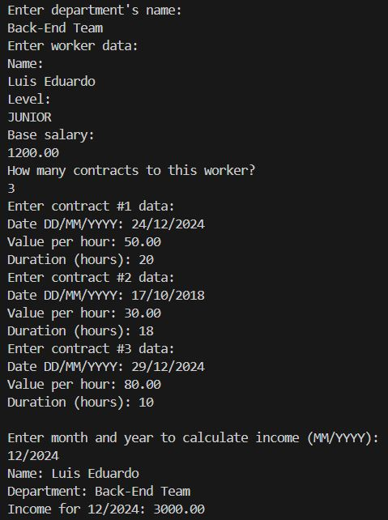

### Worker Management System

Este projeto é um sistema simples para gerenciar dados de trabalhadores, contratos por hora e calcular rendimentos com base em um mês e ano específicos. O programa permite o cadastro de informações de trabalhadores, registro de contratos e cálculo de rendimentos mensais.

---

### Funcionalidades

1. **Cadastro de trabalhador**: Inclui nome, nível, salário base e departamento.
2. **Adição de contratos por hora**: Permite registrar contratos, informando a data, valor por hora e duração.
3. **Cálculo de rendimentos**: Baseado em contratos registrados e no período especificado (MM/YYYY).

---

### Como executar

1. Clone este repositório.
2. Compile o código utilizando um ambiente Java configurado.
3. Execute o programa em um terminal ou IDE.
4. Insira os dados solicitados conforme o fluxo interativo no console.

---

### Tecnologias utilizadas

- **Java**: Linguagem principal.
- **Classes e objetos**: Para modelar o trabalhador, contratos e departamentos.
- **Pacotes**:
  - `entities`: Contém as classes `Department`, `Worker` e `HourContract`.
  - `entities_enums`: Contém a enumeração `WorkerLevel`.

---

### Resultado

---

### Contato

Dúvidas ou sugestões? Entre em contato!
